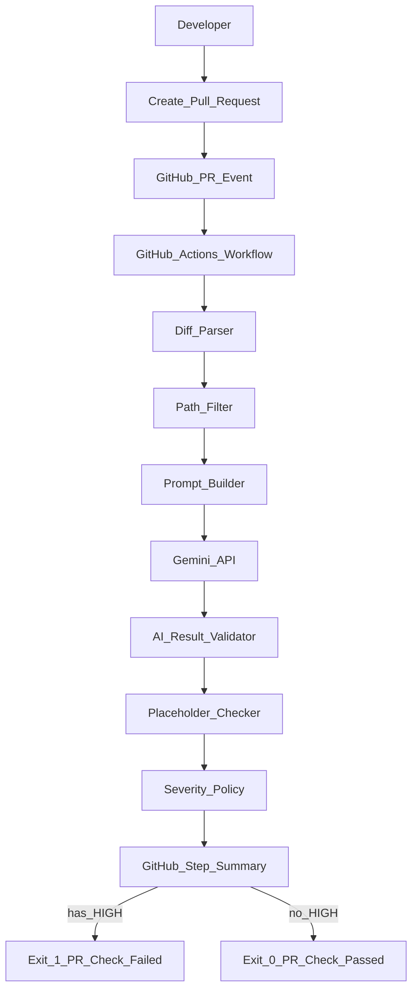

# ERD — GitHub Actions PR 用户可见文本质量门禁

**Content**

- [Project Introduction](#project-introduction)
- [Project Timeline](#project-timeline)
- [Architectural Overview](#architectural-overview)
- [Alternatives Considered](#alternatives-considered)
- [Design Considerations](#design-considerations)
- [Database Design](#database-design)
- [API and Services Design](#api-and-services-design)
- [User Interface Design](#user-interface-design)
- [Testing and Deployment](#testing-and-deployment)
- [Meeting Notes and Open Questions](#meeting-notes-and-open-questions)
- [Appendix](#appendices)

| 字段 | 内容 |
| :---- | :---- |
| Author(s) | [xiaolei li](mailto:xiaolei@unitxlabs.com) |
| Project PRD | NA（本 ERD 即工程规格来源） |
| Motivation / 样例 Jira | [SWE-18551](https://unitxlabs.atlassian.net/browse/SWE-18551)（文案质量问题样例动机，非本门禁工程 Epic） |
| ERD Ticket | TBD — 创建门禁工程 Jira 后回填 |
| Reviewers | TBD |

---

## Project Introduction {#project-introduction}

### Purpose（目的）

本文档是 **GitHub Actions Language Quality Gate** 的工程设计规格（Engineering Spec）。后续开发必须按本文档实现，不以仓库中未声明的草稿路径为准。

目标：在 **Pull Request（PR）阶段** 自动检测指定范围内新增/修改代码中的 **User-facing Text（用户可见文本）**，通过 Gemini API 发现：

- Spelling（拼写错误）
- Grammar（语法错误）
- Natural Language / Localization（自然语言与本地化表达问题）

系统通过 **GitHub Check（workflow job 结果）+ Step Summary** 反馈问题；仅 **HIGH** 严重级阻断合入。

**AI Review Engine：Google Gemini API（模型 ID 见下文锁定值）。**

主要读者：开发工程师、QA、DevOps、Reviewer、Technical Lead。

---

### Scope（范围）

#### 项目背景

用户可见文本常见于 Error Message、Log、CLI Output、UI String。当前依赖 Developer Self Review / Code Review / QA，缺少自动化，问题常在后期才发现，例如：

```python
CAMERA_NOT_FOUND_ERROR = (
    "camera[{camera_id}] not Founded，Please check whether the "
    "camera_id parameter of the configration file is correct"
)
```

问题：`Founded` → `Found`；`configration` → `configuration`；表达不自然。

#### 工程决策锁定（P0 不可摇摆）

| 决策点 | 锁定值 | 说明 |
| ----- | ----- | ----- |
| 引擎 | 仅 Gemini | cspell / LanguageTool **不入 P0** |
| 抽取策略 | Prompt-based + 路径规则过滤 | P0 **不做** AST/字符串字面量预抽取 |
| 检查范围 | **仅**白名单路径内的 PR 增量；白名单外一律跳过 | 名单只在 workflow `LOCALIZATION_GATE_PATHSPECS`，见 [路径过滤](#path-filter-spec) |
| 阻断策略 | 仅 `severity=high` → exit 1 | medium/low 写入 Summary，不阻断 |
| API 不可用 | **fail-closed** | 重试耗尽后 fail，Summary 标明原因 |
| 反馈面 | Job 失败 + `GITHUB_STEP_SUMMARY` | P0 **不发** PR Comment |
| 交付物 | 单 workflow（含路径名单）+ 主脚本 + requirements + 单测 + README | 见 [落地任务清单](#dev-checklist) |

#### P0（必须实现）— 可验收定义

| ID | 需求 | 验收标准 |
| ----- | ----- | ----- |
| P0-1 | GitHub Actions 自动运行 | workflow 位于 `.github/workflows/`，PR 事件触发 |
| P0-2 | PR Trigger | `opened` / `synchronize` / `reopened` |
| P0-3 | 增量检查 | 仅分析 base..head diff 的 **新增行**（`+`），忽略删除行 |
| P0-4 | 指定仓内路径白名单 | 仅检查 workflow `LOCALIZATION_GATE_PATHSPECS` 命中的文件；名单只在该处维护；未命中 → 空 diff → exit 0 |
| P0-5 | 多语言 | 对 **字符串内容** 中的 English / Simplified Chinese / Portuguese 做检查（非按文件 locale） |
| P0-6 | Gemini 语言检查 | 使用锁定 model id 调用 API，返回结构化 issues |
| P0-7 | 输出问题与建议 | Step Summary 与 log 含 original / problem / suggestion / severity |
| P0-8 | Severity 阻断 | 存在任一 HIGH → job fail（exit 1）；无 HIGH → exit 0 |

#### P1（本版本不做，已记录）

- PR sticky comment / inline review comment
- AST 级字符串抽取
- 结果缓存（按 diff hash）
- 配额/耗时上报到外部监控系统
- Usage Tier 升级与多 Project 轮询
- 将稳定运维/部署 Shell 路径纳入白名单（需先盘点路径）
- 前端「组件内字面量」但不在 locales/i18n 目录下的文件（需 AST 或额外目录清单）

#### Out of Scope（明确不做）

- 全仓库扫描
- 自动修复代码 / 自动提交
- 自动翻译缺失语言
- UI 截图 OCR / 图片内文本
- 将根目录草稿 `localization-quality-gate.yml`、根目录 `gemini-localization-review.yml`、cspell/LanguageTool 作为正式门禁路径
- 全仓任意 Shell/运维脚本中的 echo/printf（未写入 `LOCALIZATION_GATE_PATHSPECS` 的分散文案）；若需覆盖，**只**向 workflow 该 env 追加
- 再维护独立 paths 配置文件，或在 Python 中复制第二份业务路径名单
- 为「省 runner」再抄一份 `on.pull_request.paths`（与 PATHSPECS 双份漂移）

---

## Project Timeline {#project-timeline}

| 阶段 | 内容 | 估点（待填） |
| ----- | ----- | ----- |
| 方案设计 | 完成本 ERD 评审与定稿 | xx |
| 开发 | Workflow（含 PATHSPECS）+ Review Script + requirements | xx |
| 自测 | 单测 + 英/中/葡 fixture | xx |
| QA | 真实 PR 验证 + 分支保护 required check | xx |
| 上线 | 开启质量门禁（required status check） | — |

---

## Architectural Overview {#architectural-overview}

### High-level System Architecture



系统类型：GitHub Event Driven；无自建服务、无数据库。

### 仓库落点（唯一正式路径）

| 组件 | 路径 | 状态 |
| ----- | ----- | ----- |
| Workflow + **路径白名单（唯一数据源）** | [`.github/workflows/gemini-localization-review.yml`](.github/workflows/gemini-localization-review.yml) | **正式**；路径名单只在此 workflow 的 `LOCALIZATION_GATE_PATHSPECS` 定义 |
| Review Script | `scripts/gemini_localization_review.py` | **正式**；审查传入的 diff，**禁止**再维护一份业务路径列表 |
| 依赖锁定 | `requirements.txt`（需补齐） | P0 交付 |
| 单元测试 | `tests/`（需补齐） | P0 交付 |
| 运维说明 | `README.md`（需补齐） | P0 交付 |
| `config/localization_quality_gate_paths.yml` | — | **不采用**（路径已收口到 workflow） |
| 根目录 `localization-quality-gate.yml` | — | **废弃草稿**，勿接入 |
| 根目录 `gemini-localization-review.yml` | — | **废弃草稿**（push-to-main 版） |
| `scripts/gemini_review.py` / `scripts/languagetool_check.py` | — | 实验代码，非 P0 |
| `.cspell.json` | — | 非 P0；可保留供本地可选使用 |

### Components and Modules

#### 1. GitHub Actions Workflow

**文件：** `.github/workflows/gemini-localization-review.yml`

**职责：**

- 触发、checkout、按白名单生成 PR diff、安装依赖、调用脚本、根据 exit code 决定 Check 成败
- 将脚本输出的 Summary 片段写入 `$GITHUB_STEP_SUMMARY`（或由脚本直接 append）
- **持有路径白名单唯一定义**（见 [Path Filter](#path-filter-spec)）

**规格（必须实现）：**

| 项 | 值 |
| ----- | ----- |
| `name` | `Gemini Localization Quality Gate`（此名称用于 Branch protection required check） |
| `on.pull_request.types` | `opened`, `synchronize`, `reopened` |
| `on.pull_request.paths` | **不要单独再维护一份**；范围由下方 `LOCALIZATION_GATE_PATHSPECS` + `git diff -- pathspecs` 保证 |
| `permissions.contents` | `read` |
| `permissions.pull-requests` | `read`（P0 不发 comment；勿保留无用的 write） |
| `concurrency.group` | `${{ github.workflow }}-${{ github.event.pull_request.number || github.ref }}` |
| `concurrency.cancel-in-progress` | `true` |
| `timeout-minutes` | `10` |
| `runs-on` | `ubuntu-latest` |
| checkout | `actions/checkout@v4`，`fetch-depth: 0` |
| 路径名单 | job `env.LOCALIZATION_GATE_PATHSPECS`（**唯一**） |
| diff 命令 | `git diff <base> <head> --unified=0 -- $LOCALIZATION_GATE_PATHSPECS > pr.diff` |
| Python 依赖 | `python -m pip install -r requirements.txt` |
| Secret | `GEMINI_API_KEY` → env `GEMINI_API_KEY` |
| 调用 | `python scripts/gemini_localization_review.py pr.diff` |

**为何路径写在 workflow（而不是独立 config / 脚本常量）：**

1. 门禁的「查哪些路径」本质是 CI 范围配置，与 workflow 同文件最直观。
2. 用同一列表做 `git diff -- <pathspecs>`，白名单外文件根本不会进入 `pr.diff`，脚本无需第二套过滤逻辑。
3. 避免「workflow `on.paths` + 脚本 allowlist + 独立 yml」三处漂移。  
   注：GitHub 的 `on.pull_request.paths` **不能**引用 job env，若再写一份会双份维护，故 P0 **只用** `LOCALIZATION_GATE_PATHSPECS` + pathspec diff。

#### 2. Diff Parser

**实现位置：** `scripts/gemini_localization_review.py`（可后续拆模块，P0 允许单文件）

**输入：** unified diff 文件路径（CLI argv[1]）——内容已由 workflow 按 pathspecs 裁剪

**算法：**

1. 读取 diff 全文；若为空或仅空白 → 打印 `No changes detected` → **exit 0**（含：PR 未改白名单内路径）
2. 解析 `+++ b/<path>` 得到 `current_file`（仅用于日志/上下文）
3. 对每个以 `+` 开头且非 `+++` 的行：收集该行及前后各 **3** 行上下文
4. 去重并去掉 `---` / `+++` / `@@` 元数据行
5. 若无待审内容 → 打印 `No user-facing changes` → **exit 0**

**输出：** `review_text: str`（送给 Prompt Builder）

**脚本不做业务路径白名单判断**（名单只在 workflow）。

#### 3. Path Filter {#path-filter-spec}

**策略（锁定）：** 路径范围在 workflow 生成 diff 时用 **git pathspec** 收窄；脚本信任输入 diff。

**单一配置源（强制）：**

| 规则 | 要求 |
| ----- | ----- |
| 唯一定义处 | `.github/workflows/gemini-localization-review.yml` → `env.LOCALIZATION_GATE_PATHSPECS` |
| 谁消费 | 仅 workflow 的 `git diff ... -- $LOCALIZATION_GATE_PATHSPECS` |
| 禁止 | 独立 `config/*paths*`、Python 内业务路径常量、`on.pull_request.paths` 再抄一份 |
| 空名单 | `LOCALIZATION_GATE_PATHSPECS` 为空 → 视为配置错误，workflow 步骤应 fail（或文档要求 codeowners 禁止空 env） |

下文「技术栈说明」仅解释业务动机，**不是**第二份配置；路径增删只改 workflow 中该 env。

##### 技术栈说明（文档动机，非配置副本）

| 技术栈 | 用户可见文案常见形态 | 覆盖意图 | P0 |
| ----- | ----- | ----- | ----- |
| 前端 UI | locales、i18n CSV/JSON | optix/central/digix/report_tool/cortex 等 locales 与 apps/x `i18n.csv` | 是（写入 PATHSPECS） |
| Python | `translations*` 常量包 | `translations_optix` / `translations_backend` / `translations_prod` / `shared/config/**/translations` 等 | 是（写入 PATHSPECS） |
| Java | 资源 CSV | `apps/x/**/resources/i18n` | 是（写入 PATHSPECS） |
| Shell 及其他 | echo/printf 等分散提示 | 路径未统一 | **否**（不要写入 PATHSPECS，除非日后显式追加） |

##### Workflow 中的唯一定义（P0 初始值）

```yaml
# .github/workflows/gemini-localization-review.yml（节选）
jobs:
  localization-review:
    runs-on: ubuntu-latest
    env:
      # ===== SINGLE SOURCE OF TRUTH: edit path scope ONLY here =====
      LOCALIZATION_GATE_PATHSPECS: >-
        apps/optix/ui/locales/lang
        apps/central/central_web/src/locales/lang
        apps/central_client/src/locales/lang
        apps/digix_client/digix_client_ui/src/locales/lang
        apps/report_tool/web/src/i18n/locales
        :(glob)apps/cortex/ui/**/locales/**
        :(glob)apps/cortex/ui/**/i18n/**
        :(glob)**/translations_optix/**
        :(glob)**/translations_backend/**
        :(glob)**/translations_prod/**
        :(glob)shared/config/**/translations/**
        :(glob)**/translations*/english.py
        :(glob)**/translations*/chinese.py
        :(glob)**/translations*/portuguese.py
        :(glob)apps/x/**/resources/i18n/**
        :(glob)apps/x/central-web/**/assets/i18n.csv
        :(glob)apps/x/edge-web/**/assets/i18n.csv
      # ===== end pathspecs =====

    steps:
      - uses: actions/checkout@v4
        with:
          fetch-depth: 0

      - name: Get PR changed lines in scope
        run: |
          set -euo pipefail
          if [ -z "${LOCALIZATION_GATE_PATHSPECS// }" ]; then
            echo "LOCALIZATION_GATE_PATHSPECS is empty" >&2
            exit 1
          fi
          git diff \
            "${{ github.event.pull_request.base.sha }}" \
            "${{ github.event.pull_request.head.sha }}" \
            --unified=0 \
            -- ${LOCALIZATION_GATE_PATHSPECS} \
            > pr.diff
```

说明：`:(glob)...` 为 git pathspec 语法，用于 `**` 通配。目录前缀条目会匹配该目录下所有变更。

**扩展流程（只改一处）：**

1. 编辑 workflow 中的 `LOCALIZATION_GATE_PATHSPECS`
2. 如有需要，更新「用 pathspec 生成的 fixture diff」相关单测/文档
3. **不要**新增独立 paths 配置文件，**不要**在 `.py` 里粘贴业务路径列表

**行为示例：**

| PR 改动文件 | 是否进入 `pr.diff` / 检查 |
| ----- | ----- |
| `apps/optix/ui/locales/lang/en.json` 新增文案 | 是 |
| `apps/cortex/backend/translations_backend/english.py` | 是 |
| `apps/x/foo/resources/i18n/messages.csv` | 是 |
| `apps/optix/ui/src/components/Foo.tsx`（不在 locales） | **否** |
| `deploy/check_env.sh` 中 `echo "error"` | **否**（未写入 PATHSPECS） |
| `.github/workflows/ci.yml` | **否** |

#### 4. Prompt Builder

**输入：** `review_text`

**输出：** 完整 prompt 字符串（规则必须与 [Severity 规则](#severity-rules) 及 [JSON Schema](#json-schema) 一致）

Prompt 必须包含：

- 角色：Localization Quality Reviewer
- 只检查 user-facing text（英/中/葡）
- Ignore：变量名、函数名、类名、URL、路径、UUID、hash、debug-only、内部注释
- Placeholder 保留规则
- Severity 规则与 Blocking 规则
- **仅返回 JSON，禁止 markdown fence**

#### 5. Gemini Review Engine

| 项 | 锁定值 |
| ----- | ----- |
| Model ID | `gemini-3.1-flash-lite` |
| Endpoint | `https://generativelanguage.googleapis.com/v1beta/models/gemini-3.1-flash-lite:generateContent` |
| Auth | API Key（query `?key=` 或官方推荐 header；禁止硬编码） |
| HTTP timeout | 60s / request |
| Max retry | 3（含首次共最多 3 次尝试；指数退避 `2^attempt` 秒） |
| Retryable | HTTP 429, 500, 503；`requests` Timeout |
| Non-retryable 非 200 | 打印 body → **exit 1**（fail-closed） |
| 分片 | P0：单次请求；若 `review_text` 过大（建议阈值 100k chars）则截断并在 Summary 注明 truncated；P1 再做多请求拆分 |

#### 6. AI Result Validator

**职责：**

1. 从 API response 取 `candidates[0].content.parts[0].text`
2. **剥离**可选的 markdown code fence（```json ... ```）后再 `json.loads`（P0 必须实现，避免模型偶发 fence 导致误杀）
3. 按 [JSON Schema](#json-schema) 校验
4. 失败 → 打印原因 → **exit 1**

#### 7. Placeholder Checker

对每个 issue：比较 `original` 与 `suggestion` 中的 placeholder 集合是否一致。

识别模式（与现实现一致）：

```regex
\{[^}]+\}|%\w|\$\{[^}]+\}
```

不一致 → 打印 issue → **exit 1**（视为门禁基础设施失败，防止错误建议合入指引）

#### 8. Severity Classification {#severity-rules}

| Level | 包含 | 门禁行为 |
| ----- | ----- | ----- |
| HIGH | Spelling、Grammar、Incorrect Word Usage、严重影响理解的 Localization | **exit 1**，阻断 PR |
| MEDIUM | Wording / Readability / 一致性改进 | 写入 Summary，**不阻断** |
| LOW | Capitalization、可选风格 | 写入 Summary，**不阻断** |

强制映射（写入 Prompt）：

- 所有 spelling / grammar / incorrect word usage → **必须** HIGH
- Capitalization → **必须** LOW
- severity 字段输出小写：`high` | `medium` | `low`

#### 9. GitHub Check / Step Summary

- Check 名称 = workflow `name`：`Gemini Localization Quality Gate`
- 无 HIGH 且流程成功 → exit 0 → Check success
- 有 HIGH 或基础设施失败（缺 key、API 失败、JSON 非法、placeholder 被改）→ exit 1 → Check failure
- Step Summary 最少包含：issue 计数（按 severity）、每个 issue 的四字段、API 耗时（若可得）、是否 truncated

---

## Alternatives Considered {#alternatives-considered}

| 方案 | 优点 | 缺点 | 结论 |
| ----- | ----- | ----- | ----- |
| LanguageTool | 免费 | 多语言/上下文弱；仓库脚本当前不阻断 | 不入 P0 |
| CSpell | 快 | 仅拼写 | 不入 P0 |
| Vale | 规则丰富 | 难理解上下文 | 不入 P0 |
| GitHub SpellCheck Action | 部署简单 | 主要拼写 | 不入 P0 |
| OpenAI API | 效果好 | 成本较高 | 不采用 |
| **Gemini API** | 多语言、上下文、Grammar+Spelling、额度较友好 | 依赖第三方；有 FP | **P0 采用** |

选择 Gemini 原因：英/中/葡能力、上下文理解、Prompt 可扩展、成本可接受。

---

## Design Considerations {#design-considerations}

### Backward Compatibility

- 不修改业务运行逻辑
- 新增 CI 门禁；通过 Branch protection 启用 required check 后才会阻断合入

### Security and Data Privacy

**API Key**

- 仅存 GitHub Secret：`GEMINI_API_KEY`
- Workflow：`env.GEMINI_API_KEY: ${{ secrets.GEMINI_API_KEY }}`
- 禁止：硬编码、写入 PR 输出、写入 log/Summary

**上传内容**

- 仅 PR 增量文本 + 必要上下文
- 不上传：完整 git 历史、secret 文件、binary

**权限最小化**

- P0：`contents: read`；`pull-requests: read`（或不声明 write）

### Scalability and Performance

| 规模 | 预期耗时 |
| ----- | ----- |
| 50 行相关 Diff | 3–5s |
| 200 行 | 5–10s |
| 500 行 | 10–20s |

并发：同 PR 使用 concurrency 取消旧 run，降低 Free Tier RPM 冲突。

### Potential Risks

| 风险 | 缓解 |
| ----- | ----- |
| 429 / Timeout / 5xx | Retry + backoff；耗尽后 fail-closed |
| Gemini 不可用 | Workflow fail；Summary 标明；人工可临时取消 required check |
| False Positive | Reviewer 最终确认；可后续加 allowlist（P1） |
| Free Tier 配额 | 见下表；接近上限时升级 Usage Tier |

#### Gemini API 配额（Free Tier 参考）

| 项目 | 配额 |
| ----- | ----- |
| 模型 | `gemini-3.1-flash-lite` |
| RPM | 15 / 分钟 |
| TPM | 250,000 / 分钟 |
| RPD | 500 / 天 |

注：以 Google AI Studio / 官方文档实时值为准。

假设：多数 PR 1 次 API 调用；大正文可能截断（P0）或 P1 拆成 2–3 次。

### Exit Code 语义（契约）

| Exit | 含义 | Check |
| ----- | ----- | ----- |
| 0 | 无变更 / 无待审文本 / 无 HIGH issue | Pass |
| 1 | 存在 HIGH / 缺 API Key / API 失败 / JSON 非法 / placeholder 被篡改 | Fail |

---

## Database Design {#database-design}

N/A。本系统无持久化存储；状态仅存在于 GitHub Actions run 与 Check 结果。

---

## API and Services Design {#api-and-services-design}

### Gemini generateContent

- **Method：** POST
- **URL：** `https://generativelanguage.googleapis.com/v1beta/models/gemini-3.1-flash-lite:generateContent`
- **Auth：** API Key
- **Request body（最小）：**

```json
{
  "contents": [
    {
      "parts": [{ "text": "<prompt including review_text>" }]
    }
  ]
}
```

- **期望模型输出：** 见 [JSON Schema](#json-schema)

| HTTP | 处理 |
| ----- | ----- |
| 200 | 解析并校验 |
| 429 / 500 / 503 | Retry + backoff |
| 其他非 200 | 不重试，exit 1 |
| Timeout | Retry + backoff |
| 重试耗尽 | exit 1（fail-closed） |

### CLI 契约

```text
python scripts/gemini_localization_review.py <diff_file>
```

**环境变量：**

| 变量 | 必需 | 说明 |
| ----- | ----- | ----- |
| `GEMINI_API_KEY` | 是 | 缺失 → exit 1 |
| `GITHUB_STEP_SUMMARY` | 否 | 若存在则 append Markdown 报告 |

### JSON Schema {#json-schema}

```json
{
  "type": "object",
  "required": ["has_issue", "issues"],
  "properties": {
    "has_issue": { "type": "boolean" },
    "issues": {
      "type": "array",
      "items": {
        "type": "object",
        "required": ["original", "problem", "suggestion", "severity"],
        "properties": {
          "original": { "type": "string", "minLength": 1 },
          "problem": { "type": "string", "minLength": 1 },
          "suggestion": { "type": "string", "minLength": 1 },
          "severity": { "type": "string", "enum": ["high", "medium", "low"] }
        }
      }
    }
  }
}
```

无问题时：

```json
{ "has_issue": false, "issues": [] }
```

有问题时示例：

```json
{
  "has_issue": true,
  "issues": [
    {
      "original": "camera [{camera_id}] not Founded",
      "problem": "Grammatical error. 'Founded' is the wrong word; use past participle of 'find'.",
      "suggestion": "camera [{camera_id}] not found",
      "severity": "high"
    }
  ]
}
```

**一致性规则：**若 `has_issue=false` 则 `issues` 必须为 `[]`；若 `issues` 非空则 `has_issue` 应为 `true`（校验失败 → exit 1）。

---

## User Interface Design {#user-interface-design}

无独立 UI。开发者界面 = GitHub PR Checks + Actions log + Step Summary。

**Step Summary 模板（必须）：**

```markdown
## Localization Quality Gate

- Status: PASSED | FAILED
- High: N | Medium: N | Low: N
- Duration: Xs
- Truncated: yes/no

### Issues
| Severity | Original | Problem | Suggestion |
| --- | --- | --- | --- |
| high | ... | ... | ... |
```

---

## Testing and Deployment {#testing-and-deployment}

### Engineering Testing

#### Unit Test（`tests/`，覆盖率目标 ≥90% 针对可测纯函数）

必须覆盖：

| 模块 | 用例要点 |
| ----- | ----- |
| Diff Parser | 空 diff；仅删除；新增行+上下文；多文件 |
| Path Filter | N/A（范围由 workflow pathspec diff 保证）；单测可用带/不带白名单路径的 diff fixture |
| Result Parser | 合法 JSON；带 fence 的 JSON；缺字段；非法 severity |
| Placeholder | 一致通过；`{camera_id}` 被改则失败 |
| Severity Policy | 仅 high 导致 failed=True |

依赖：`pytest`；mock Gemini HTTP（不在单测打真实 API）。

#### Integration Test

- 使用仓库内故意含错样本（如 `test.py` / `test.sh`）构造 diff fixture
- 可选：带 `GEMINI_API_KEY` 的手动/ nightly 集成（不强制每次 CI）

#### UAT

真实 PR 覆盖：Python、Shell（及团队常用语言文件类型）。

### QA Testing 矩阵

| 用例 | 语言 | 期望 |
| ----- | ----- | ----- |
| 英文拼写错误（configration） | EN | HIGH，阻断 |
| 英文语法（Founded） | EN | HIGH，阻断 |
| 中文语序/标点明显错误 | ZH | HIGH 或按 Prompt 规则 |
| 葡萄牙语拼写/重音错误 | PT | HIGH，阻断 |
| 仅 capitalization | EN | LOW，不阻断 |
| 无用户可见文本变更 | — | exit 0 |
| 缺 API Key | — | exit 1 |
| API 429 后成功 | — | 最终 exit 按 issues |
| API 持续失败 | — | exit 1（fail-closed） |
| suggestion 改掉 `{id}` | — | exit 1 |

### Deployment

1. 合并正式 workflow + script + requirements + tests
2. 仓库 Settings → Secrets 配置 `GEMINI_API_KEY`
3. 目标分支 Branch protection → Require status checks → 勾选 **`Gemini Localization Quality Gate`**
4. 无需部署 Server

### Monitoring（P0 落点）

P0 仅在 Step Summary / log 记录：

- API 耗时
- Issue 计数（H/M/L）
- 成功/失败原因（含 fail-closed 原因）

Token 用量：若 response 含 usage metadata 则写入 Summary；否则标 N/A。外部监控系统为 P1。

---

## Meeting Notes and Open Questions {#meeting-notes-and-open-questions}

### 已关闭（本 ERD 锁定）

| 问题 | 决议 |
| ----- | ----- |
| 是否混合 cspell/LT？ | 否，P0 仅 Gemini |
| User-facing 如何抽取？ | Prompt-only + 路径规则 |
| API 故障是否放行？ | 否，fail-closed |
| 是否发 PR Comment？ | P0 否，仅 Check + Summary |
| 多语言按文件还是按字符串？ | 按字符串内容 |
| 检查哪些仓内路径？ | **仅** workflow `LOCALIZATION_GATE_PATHSPECS`；Shell 分散文案 P0 不写入 |
| 路径名单维护几处？ | **仅一处**：`.github/workflows/gemini-localization-review.yml` 的该 env |

### 仍开放（不阻塞 P0 开发）

| 问题 | Owner | 备注 |
| ----- | ----- | ----- |
| 门禁工程独立 Jira Epic / ERD Ticket | PM/TL | 回填文首表格 |
| Timeline story points | TL | 回填 Timeline |
| 是否将部分运维 Shell 路径追加进白名单 | TL | **只**追加到 `LOCALIZATION_GATE_PATHSPECS` |
| False Positive allowlist 格式 | Eng | P1 |
| `apps/x/central-web` / `edge-web` 实际目录名是否与 monorepo 完全一致 | Eng | 落地前只改 workflow 中 pathspec |

---

## Appendices {#appendices}

### Glossary

| 术语 | 说明 |
| ----- | ----- |
| Language Quality Gate | PR 阶段语言质量检查 |
| User-facing Text | 用户可见文本（错误信息、UI、CLI、面向用户的日志等） |
| Diff Parser | 解析 PR Diff 并提取新增内容 |
| Prompt-based Filtering | 由模型按 Prompt 判断是否为用户可见文本 |
| Path config（单一数据源） | workflow `LOCALIZATION_GATE_PATHSPECS` + `git diff -- pathspecs` |
| Severity | `high` / `medium` / `low` |
| fail-closed | 基础设施失败时阻断 PR |
| Required Check | Branch protection 强制要求的 GitHub Check |

### References

- [GitHub Actions Documentation](https://docs.github.com/en/actions)
- [Gemini API / Rate Limits](https://ai.google.dev/gemini-api/docs/rate-limits)

### 与当前原型对齐说明

以本仓库现有实现为起点演进，而非推倒重来：

| 已有能力 | 来源 | ERD 要求 |
| ----- | ----- | ----- |
| PR diff `--unified=0` | workflow | 保留 |
| 仅新增行 + 3 行上下文 | script | 保留 |
| 忽略 `.github/`、`scripts/` | script 硬编码 exclude | **改为**不在 PATHSPECS 中即可（不必进 diff） |
| Retry 429/5xx/timeout | script | 保留 |
| JSON 字段校验 | script | 保留并加强 fence 剥离与 has_issue 一致性 |
| Placeholder 一致性 | script | 保留 |
| HIGH → exit 1 | script | 保留 |
| Step Summary | 部分缺失 | **P0 补齐** |
| `requirements.txt` / 单测 / concurrency / timeout | 缺失 | **P0 补齐**（`requests`；无需 PyYAML） |
| `pull-requests: write` | workflow | **改为 read**（P0 不发 comment） |
| 路径过滤粒度 | 仅 exclude | **P0：名单只在 workflow PATHSPECS**；`git diff -- pathspecs` 收窄 |

### 开发落地任务清单 {#dev-checklist}

按顺序执行；每步完成后对应验收勾选。

#### Phase 1 — Workflow 硬化（含唯一路径名单）

1. 更新 `.github/workflows/gemini-localization-review.yml`：concurrency、timeout、permissions、`LOCALIZATION_GATE_PATHSPECS`、`git diff -- $LOCALIZATION_GATE_PATHSPECS`
2. 空 PATHSPECS 时步骤 fail；**不要**另写 `on.pull_request.paths` 或独立 paths 文件
3. 确认 Secret 名称为 `GEMINI_API_KEY`
4. **验收：** 白名单内改动进入 `pr.diff`；白名单外改动不在 diff 中；脚本无业务路径硬编码

#### Phase 2 — Script 按契约补齐

1. 脚本审查传入 diff（不再加载路径配置文件）
2. 响应解析：剥离 markdown fence
3. `has_issue` ↔ `issues` 一致性校验
4. 写入 `GITHUB_STEP_SUMMARY`
5. 大 diff 截断 + Summary 标记
6. **验收：** 含错文案的 in-scope diff → exit 1；空 / 白名单外 → exit 0

#### Phase 3 — 依赖与测试

1. 新增 `requirements.txt`（`requests`；开发/测试加 `pytest`）
2. 新增 `tests/` 覆盖 Diff / Validator / Placeholder / Severity（路径范围用不同 fixture diff 模拟）
3. **验收：** `pytest` 本地全绿；核心纯函数覆盖率 ≥90%

#### Phase 4 — 文档与废弃路径

1. 新增简短 `README.md`：如何配置 Secret、如何看 Summary、如何设 required check
2. 在 README 或本 ERD 注明：根目录草稿 yml 与 LT/cspell 路径废弃
3. **验收：** 新成员可按 README 在测试仓跑通一次 PR

#### Phase 5 — 上线

1. 目标分支启用 required status check：`Gemini Localization Quality Gate`
2. QA 按 [QA Testing 矩阵](#testing-and-deployment) 跑真实 PR
3. **验收：** HIGH 无法合入；无 HIGH 可合入；API 故障时 Check 失败（fail-closed）

### 验收矩阵（Definition of Done）

| ID | 场景 | 期望 Exit | Check |
| ----- | ----- | ----- | ----- |
| A1 | 空 diff | 0 | Pass |
| A2 | 仅改 `.github/workflows/*` 或白名单外业务代码 | 0 | Pass |
| A3 | 白名单内新增英文拼写错误用户文案 | 1 | Fail |
| A3b | 白名单外文件含同样拼写错误 | 0 | Pass |
| A3c | `LOCALIZATION_GATE_PATHSPECS` 为空 | 1 | Fail（workflow 步骤） |
| A4 | 仅 MEDIUM/LOW | 0 | Pass（Summary 有告警） |
| A5 | 模型返回带 markdown json code fence | 0 或 1 按内容 | 不得因 fence 误 fail |
| A6 | suggestion 丢掉 `{camera_id}` | 1 | Fail |
| A7 | 无 `GEMINI_API_KEY` | 1 | Fail |
| A8 | API 持续 503 | 1 | Fail |
| A9 | 仅改 `deploy/*.sh` 中 echo 文案 | 0 | Pass（Shell 非 P0） |

### Prompt 正文规格（实现必须对齐）

实现时 Prompt 内容须覆盖下列条款（允许排版调整，语义不可删）：

1. Review only user-facing texts in PR changes（EN / ZH / PT）
2. Ignore identifiers, URLs, paths, UUIDs, hashes, debug-only, internal comments
3. `original` 必须为完整用户可见原文；`suggestion` 仅修正错误部分
4. Placeholders `{...}` / `%s` 类 / `${...}` 必须保持一致
5. Severity 与 Blocking 规则同 [Severity Classification](#severity-rules)
6. Return JSON only；no markdown；no prose outside JSON

---

**文档状态：** Optimized ERD（可开发规格）— 开发应以本文为准；与旧叙述冲突时以「工程决策锁定」与「组件规格」章节为准。
